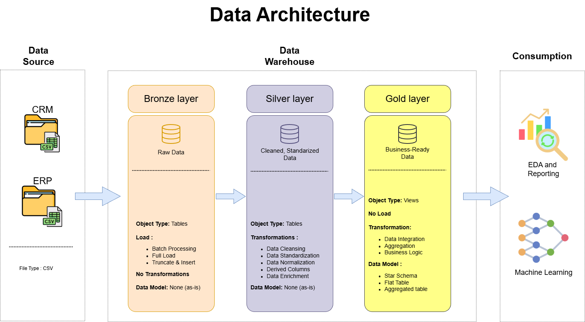

# Data Warehouse Project

## Acknowledgment 🙏

This project is inspired by and based on the excellent work from:  
**DataWithBaraa – SQL Data Warehouse Project**  
https://github.com/DataWithBaraa/sql-data-warehouse-project

Special thanks to **Baraa** for the clear structure, methodology, and educational approach that formed the foundation of this implementation.

---

## Project Objective

This project demonstrates the design and implementation of a modern SQL-based Data Warehouse using Microsoft SQL Server.
It focuses on transforming raw source data into structured, analytics-ready datasets by applying industry best practices in data engineering and data modeling.

---

## Architecture Overview 🏗️

This Data Warehouse follows the **Medallion Architecture** pattern:

- **Bronze Layer**  
  Stores raw data ingested directly from source files without transformation.

- **Silver Layer**  
  Cleans, standardizes, and integrates data by applying validation rules and business logic.

- **Gold Layer**  
  Models the data to analytics-ready data using dimensional design (facts and dimensions), optimized for querying.

---

## ETL Process Summary 🔄

1. **Extract**  
   Raw source data is loaded into the Bronze layer.

2. **Transform**  
   Data is cleaned, standardized, and enriched in the Silver layer.

3. **Load**  
   Final analytical tables are created in the Gold layer using a dimensional (Star Schema) model.

All stages are implemented using modular and reusable **T-SQL scripts**.

---

## Key Takeaways 🎯

- End-to-end Data Warehouse implementation
- Practical use of SQL Server for ETL pipelines
- Clear separation of concerns using layered architecture
- Realistic data engineering workflow and best practices

